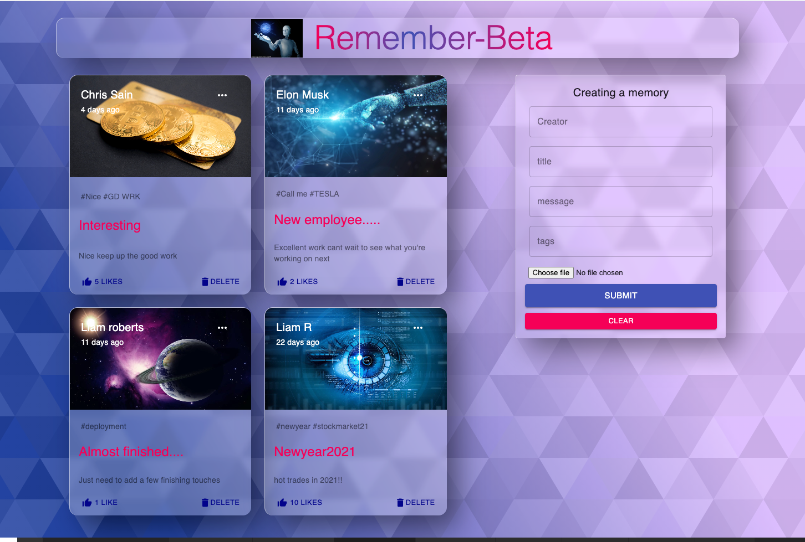

# Remember-beta
### [LIVE APP](https://remember-beta.netlify.app/)
<div>

</div>
&nbsp
<div>


</div>


### Technologies: MongoDB, Express, React, Node.js, JavaScript, HTML, CSS, Material-UI, Axios, npm

## Index
* [Project Direction](#Project)
* [Installation](#Install)
* [Usage](#Usage)
* [Improvemets](#Improvements)

## <a name="Project">Project Direction</a>
I created this app to improve my understanding of full stack development using the MERN stack. I learned alot during the course of making this app including using Material-ui for size repsonsive styling, component separation to keep file structure clean, creating a schema and using mongdDB. This has inspired me to get a deeper understanding of the mern stack and to keep learning through trying new projects and ideas.

## <a name="Install">Installation</a>
The deployed live app is [HERE](https://remember-beta.netlify.app/)
The backend API deployed to heroku is [HERE](https://remember-beta.herokuapp.com/posts)

* To clone the repo
```shell
$ git clone git@github.com:lroberts77/remember-beta.git
$ cd remember-beta
$ cd server
$ npm install
$ cd ..
$ cd client
$ npm install
```

## <a name="Usage">Usage</a>
* Go to mongodb.com create a database and paste the the link from connect your application into the server/.env file after CONNECTION_URL =

* Open a terminal
```shell
$ cd server
$ npm start
```
* Open another terminal 
```shell
$ cd client
$ npm start
```

If a tab doesn't open with the remember-beta app running, open a new tab and type in http://localhost:3000 in the url bar and press enter.

Fill in the form and press submit to create a post which will be displayed top left once it has been saved to mongdDB. If you want to edit your post click on the three dots in the top right corner of your post which will populate the form with your postdata then edit and submit to complete. You can also like posts and delete posts by clicking on like and delete.

## <a name="Improvements">Improvements</a>
* Experiment with styling
* make app responsive to tablet sizes
* Add log in and out feature